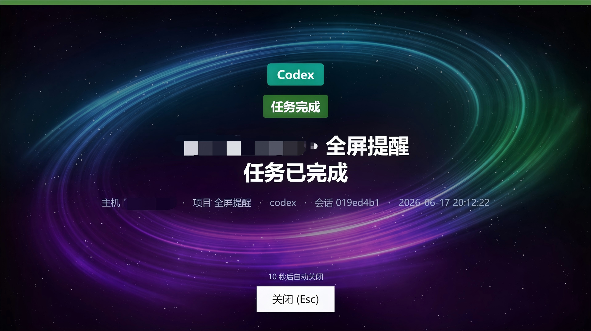
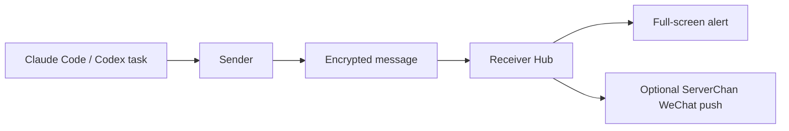

# 🔔 Claude Code/Codex Task Completion Reminder

[](#)
[](#)
[](LICENSE)

[中文说明](README.md)

Fullscreen Reminder is a Windows task reminder tool built around a **receiver** and one or more **senders**. Senders watch task activity from tools such as Claude Code and Codex, while the receiver displays strong full-screen alerts on the Windows desktop. Optional ServerChan forwarding can also push notifications to WeChat.

> Built for long-running agent tasks, completion notices, permission prompts, and moments when you do not want to miss a human-in-the-loop confirmation.

<p align="center">
  
</p>

## ✨ Highlights

| Capability | Description |
| --- | --- |
| 🖥️ Full-screen alerts | The receiver overlays selected monitors when an authenticated reminder arrives. |
| 🧩 Multiple senders | One receiver can pair with multiple sender machines. Each sender gets its own device ID and message key. |
| 🔐 Safer pairing | Pairing codes contain only a one-time enrollment secret, expire in about 10 minutes, and are invalidated after enrollment. |
| 🧭 Task context | Notifications can include message type, latest command, time, project, path, host, and session details. |
| 🧰 Tray controls | Receiver and sender actions are available from Windows tray menus. |
| 🧱 Multi-monitor support | Choose target screens, custom backgrounds, and auto-close countdown behavior. |
| 📮 WeChat forwarding | Optional ServerChan forwarding can push completion or confirmation messages to WeChat. |

## 🧭 How It Works



## 🚀 Quick Start

1. Install the receiver on the machine that should display full-screen alerts.
2. Install the sender on each machine that runs Claude Code or Codex.
3. Right-click the receiver tray icon and choose “Add sender”.
4. Paste the pairing code into the sender tray dialog named “Connect to receiver”.
5. Repeat “Add sender” for additional sender machines.
6. Use “Manage senders” from the receiver tray menu to inspect status or revoke one sender.

## 🧰 Project Layout

```text
.
├─ src/
│  ├─ Reminder.Receiver      # Receiver: Hub, tray UI, overlay window, sender management
│  ├─ Reminder.Sender        # Sender: tray app, Codex watcher, Claude Code hooks, outbox queue
│  └─ Reminder.Protocol      # Protocol: encrypted envelopes, pairing codes, message types, DTOs
├─ installer/
│  └─ Reminder.Setup         # Windows installer
├─ tests/
│  └─ Reminder.Protocol.Tests # Protocol and encryption tests
└─ scripts/
   └─ package.ps1            # Rebuilds the installer bundle
```

## 🛠️ Build

Install the .NET 8 SDK with Windows desktop workload support.

```powershell
dotnet build Reminder.sln
dotnet run --project tests\Reminder.Protocol.Tests\Reminder.Protocol.Tests.csproj
```

## 📦 Package

```powershell
powershell -ExecutionPolicy Bypass -File scripts\package.ps1
```

Generated output:

```text
全屏提醒-安装包.zip
```

The packaging script publishes the receiver and sender, then embeds the payload into the installer. Generated artifacts such as `payload.zip`, `bin/`, `obj/`, installer folders, and package archives are ignored by `.gitignore` and should not be committed.

## 🔐 Security Notes

- Pairing codes contain only a one-time enrollment secret, not the global master key.
- Each sender has its own device ID and message key.
- Unconfirmed devices must enroll before the pairing deadline.
- Messages use authenticated encryption and replay protection.
- The statistics endpoint is restricted to local loopback access.
- The installer validates extraction paths and rejects path traversal attempts.
- ServerChan forwarding sends notification content to a third-party service; enable it only if that data sharing is acceptable.

## 🧪 Tests

The protocol tests cover:

- Key derivation
- Encryption and decryption
- Replay protection
- Pairing code parsing
- New pairing codes not exposing the master key
- Template field rendering
- Cross-implementation test vectors

Run:

```powershell
dotnet run --project tests\Reminder.Protocol.Tests\Reminder.Protocol.Tests.csproj
```

## ❓ FAQ

**Does publishing the source code allow others to connect to my computer?**

No. The source code describes the implementation, but real connections still require a valid pairing code, device enrollment, and authenticated encrypted messages.

**Can I connect multiple senders?**

Yes. Generate a separate pairing code for each sender. The receiver tray menu includes “Manage senders” for status inspection and revocation.

**Can I share a pairing code with others?**

It is not recommended. A pairing code is a short-lived secret and should only be shown to sender devices you trust.

**Is ServerChan forwarding enabled by default?**

No. It is enabled only after you manually configure a SendKey from the receiver tray menu.

## 🗺️ Roadmap Ideas

- Better sender naming and notes.
- More graphical message type configuration.
- Automated release packaging.
- Additional task source integrations.

## 📄 License

This project is licensed under the [MIT License](LICENSE).
