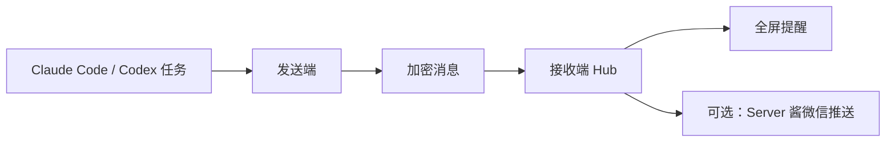

# 🔔 全屏提醒

[](#)
[](#)
[](LICENSE)

[English README](README.en.md)

全屏提醒是一个面向 Windows 的任务提醒工具，由 **接收端** 和 **发送端** 组成。发送端监听 Claude Code / Codex 等任务状态，接收端在本机弹出强提示的全屏提醒，也可以选择通过 Server 酱推送到微信。

> 适合长时间跑任务、等待代码代理完成、需要人工确认时不想错过提醒的场景。

## ✨ 功能亮点

| 能力 | 说明 |
| --- | --- |
| 🖥️ 全屏提醒 | 接收端收到消息后覆盖指定屏幕显示，减少错过关键确认的概率。 |
| 🧩 多发送端 | 一台接收端可配对多台发送端，每台发送端都有独立设备编号和消息密钥。 |
| 🔐 安全配对 | 配对码只包含一次性登记密钥，约 10 分钟有效，登记成功后立即作废。 |
| 🧭 任务上下文 | 提醒可包含任务类型、最近指令、时间、项目、路径、主机和会话信息。 |
| 🧰 托盘管理 | 接收端和发送端都提供托盘菜单，常用操作不需要打开命令行。 |
| 🧱 多屏控制 | 可选择提醒出现在哪些屏幕上，并支持自定义背景和自动关闭倒计时。 |
| 📮 微信推送 | 可选 Server 酱推送，把任务完成、需要确认等消息同步到微信。 |

## 🧭 工作流程



## 🚀 快速开始

1. 在接收端电脑运行安装器，选择安装“接收端”。
2. 在运行 Claude Code / Codex 的电脑安装“发送端”。
3. 右键接收端托盘图标，选择「添加发送端」。
4. 把配对码粘贴到发送端托盘的「连接到接收端」窗口。
5. 需要多台发送端时，重复「添加发送端」即可。
6. 在接收端托盘「管理发送端」里查看状态或撤销单台发送端。

## 🧰 项目结构

```text
.
├─ src/
│  ├─ Reminder.Receiver      # 接收端：Hub、托盘、全屏窗口、发送端管理
│  ├─ Reminder.Sender        # 发送端：托盘、Codex 监视、Claude Code 钩子、发送队列
│  └─ Reminder.Protocol      # 协议：加密信封、配对码、消息类型、数据结构
├─ installer/
│  └─ Reminder.Setup         # Windows 安装器
├─ tests/
│  └─ Reminder.Protocol.Tests # 协议与加密测试
└─ scripts/
   └─ package.ps1            # 重新生成安装包
```

## 🛠️ 本地构建

需要安装 .NET 8 开发工具，并在 Windows 上构建桌面程序。

```powershell
dotnet build Reminder.sln
dotnet run --project tests\Reminder.Protocol.Tests\Reminder.Protocol.Tests.csproj
```

## 📦 生成安装包

```powershell
powershell -ExecutionPolicy Bypass -File scripts\package.ps1
```

生成结果：

```text
全屏提醒-安装包.zip
```

安装包生成过程会重新发布接收端和发送端，并把负载打进安装器。`payload.zip`、`bin/`、`obj/`、安装包目录和压缩包都被 `.gitignore` 排除，不应提交到仓库。

## 🔐 安全设计

- 配对码只包含一次性登记密钥，不携带全局主密钥。
- 每个发送端使用独立设备编号和消息密钥。
- 未确认设备必须在配对有效期内完成登记，逾期自动作废。
- 消息使用认证加密，并带有重放保护。
- 统计接口仅允许本机访问。
- 安装器解压时校验路径，拒绝路径穿越。
- Server 酱推送会把通知内容发送到第三方服务，请只在接受外发范围时启用。

## 🧪 测试

协议测试覆盖：

- 密钥派生
- 加密与解密
- 重放保护
- 配对码解析
- 新配对码不携带主密钥
- 模板字段渲染
- 跨实现测试向量

运行方式：

```powershell
dotnet run --project tests\Reminder.Protocol.Tests\Reminder.Protocol.Tests.csproj
```

## ❓ 常见问题

**公开源码会不会让别人连到我的电脑？**

不会。公开源码只公开实现方式，真实连接仍需要有效配对码、设备登记和认证加密消息。

**可以接入多台发送端吗？**

可以。每台发送端都需要单独生成配对码。接收端托盘里的「管理发送端」可以查看状态或撤销指定发送端。

**配对码可以发给别人吗？**

不建议。配对码是短时机密，只应该展示给你信任的发送端设备。

**Server 酱推送默认开启吗？**

不会。只有在接收端托盘里手动设置 SendKey 后才会启用。

## 🗺️ 后续方向

- 增加更完整的发送端命名与备注。
- 增加图形化的消息类型配置。
- 增加发布页自动打包流程。
- 增加更多任务来源适配。

## 📄 许可证

本项目使用 [MIT 许可证](LICENSE)。
